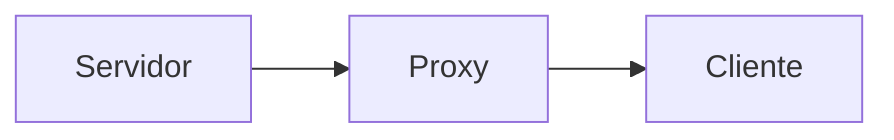
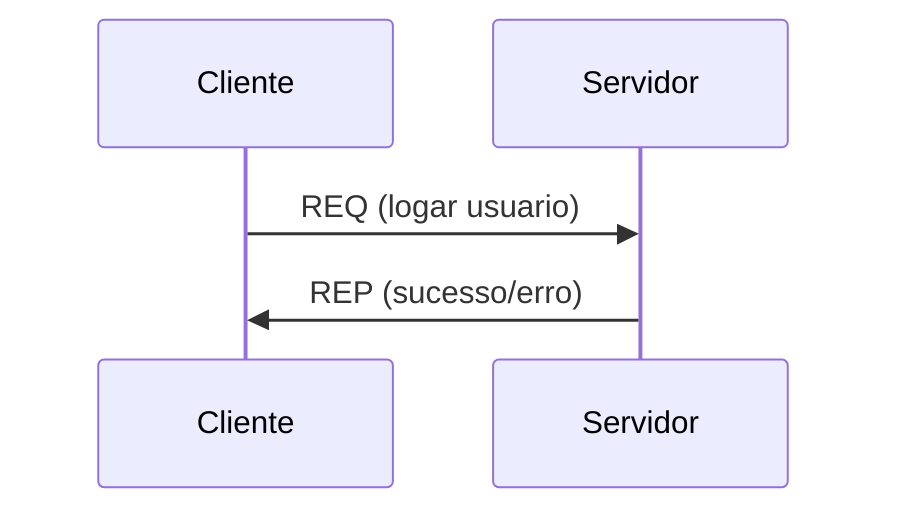
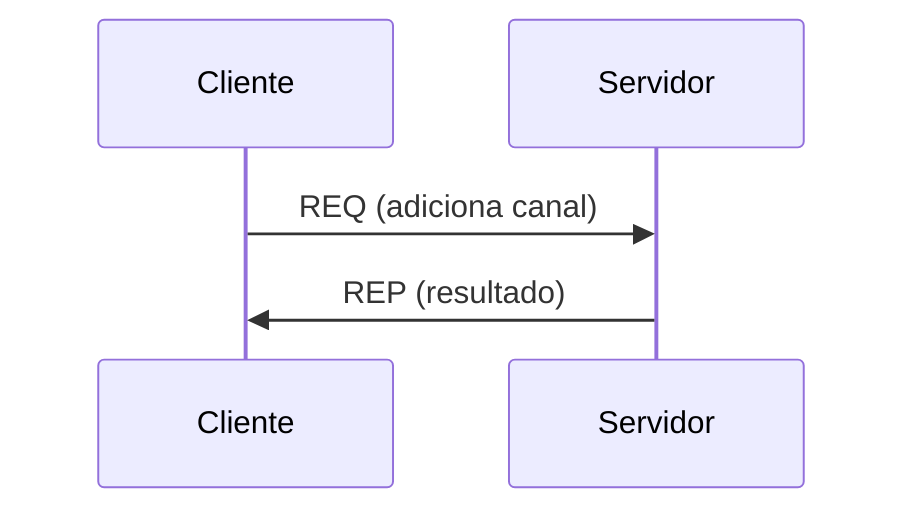
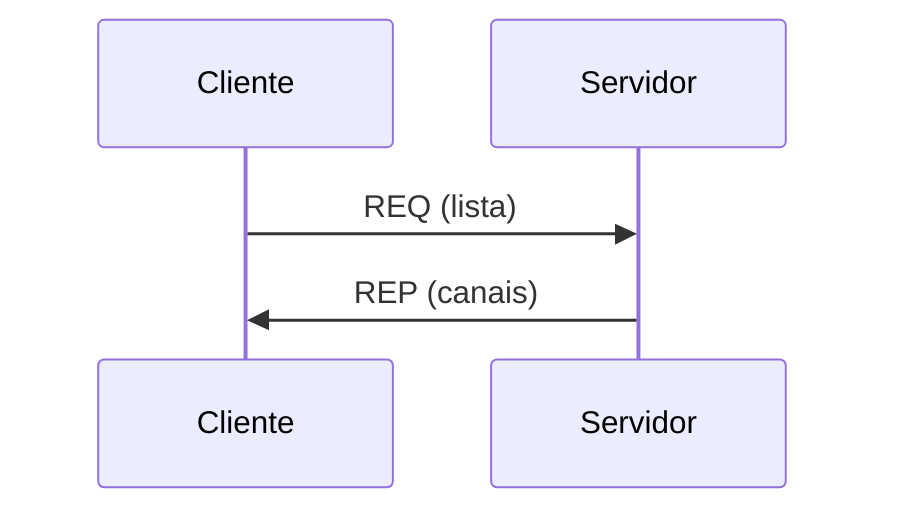
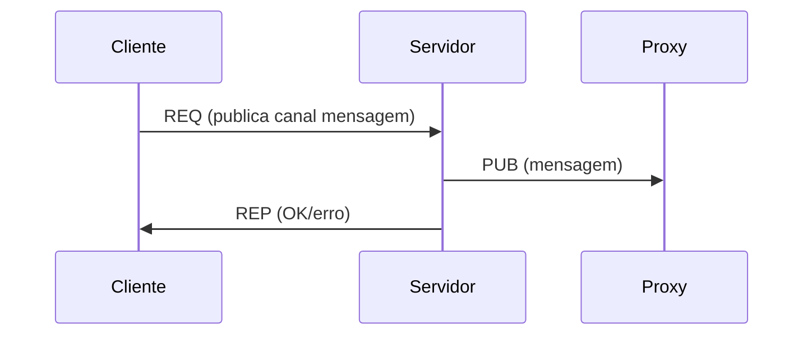

<div align="center">

# PROJETO DE SISTEMAS DISTRIBUÍDOS
</div>

## 📖 Descrição

Este projeto implementa um sistema distribuído de troca de mensagens inspirado em sistemas clássicos como BBS (Bulletin Board System) e IRC (Internet Relay Chat).

O sistema permite que múltiplos clientes (bots) se conectem a servidores, realizem login, criem canais, listem canais disponíveis e publiquem mensagens em canais — tudo de forma distribuída, escalável e automatizada.

A comunicação entre os serviços é feita utilizando **ZeroMQ**, garantindo eficiência, baixo acoplamento e interoperabilidade entre **Java (JeroMQ)** e **Python (PyZMQ)**.

---

# 🚀 Funcionalidades

## 🔹 Parte 1 – Req/Rep

### 🔐 Login de Usuário

* Cliente envia nome de usuário
* Servidor valida e responde:

  * sucesso ✅
  * erro ❌

### 📂 Criação de Canais

* Clientes criam canais
* Servidor valida duplicidade

### 📋 Listagem de Canais

* Retorno de todos os canais cadastrados

### 💾 Persistência

* Logins
* Canais criados

## 🔹 Parte 2 – Pub/Sub

### 📡 Publicação em Canais

* Cliente solicita publicação ao servidor
* Servidor publica no canal correspondente

### 📥 Inscrição em Canais

* Clientes se inscrevem em múltiplos canais
* Recebem mensagens automaticamente

### ⏱️ Controle de Tempo

Cada mensagem contém:

* Timestamp de envio (servidor)
* Timestamp de recebimento (cliente)

### 💾 Persistência Avançada

* Publicações armazenadas em disco
* Requisições registradas (log completo)

---

# 🧠 Arquitetura

O sistema foi dividido em dois modelos de comunicação independentes:

## 🔁 Req/Rep (Parte 1)


* Cliente: REQ
* Servidor: REP
* Broker: ROUTER/DEALER

✔ Permite escalabilidade
✔ Balanceamento de carga
✔ Desacoplamento

---

## 📡 Pub/Sub (Parte 2)



* Servidor: PUB
* Cliente: SUB
* Proxy: XSUB/XPUB

---

# 🔄 Fluxos de Comunicação

## Login



## Criar canal



## Listar canais



## Publicação (Parte 2)



---

# 🧾 Formato das Mensagens

## Req/Rep (comandos)

```text
logar usuario
adiciona canal
lista
publica canal mensagem
```

## Pub/Sub (eventos)

```text
canal timestamp mensagem
```

---

# 🤖 Comportamento dos Bots

Os clientes foram implementados como bots automáticos:

1. Realizam login com usuário aleatório
2. Criam canais se existirem menos de 5
3. Inscrevem-se em até 3 canais
4. Executam continuamente:

   * Escolhem um canal aleatório
   * Enviam 10 mensagens
   * Aguardam 1 segundo entre envios
   * Recebem mensagens dos canais inscritos

✔ Simula ambiente real
✔ Facilita testes e validação

---

# 💾 Armazenamento de Dados

O servidor realiza persistência em arquivos locais:

## 📌 Publicações

```text
canal;mensagem;timestamp
```

## 📌 Requisições

```text
REQ;conteudo;timestamp
```

### 🎯 Justificativa

* Garantir histórico completo
* Permitir auditoria
* Possibilitar recuperação futura

---

# ⚙️ Escolhas de Projeto

### ✔ Uso de Broker (ROUTER/DEALER)

* Permite múltiplos servidores
* Balanceamento automático

### ✔ Proxy Pub/Sub separado

* Isola responsabilidades
* Evita mistura de padrões

### ✔ Uso de tópicos como canais

* Aproveita nativamente o ZeroMQ
* Filtragem eficiente no cliente

### ✔ Servidor como intermediador

* Centraliza validação
* Garante consistência
* Permite persistência

### ✔ Interoperabilidade Java + Python

* Demonstra compatibilidade entre linguagens
* Facilita testes e prototipação

---

# 🛠️ Tecnologias Utilizadas

* ZeroMQ (JeroMQ / PyZMQ)
* Docker / Docker Compose

---

# 💻 Linguagens Utilizadas

* Java
* Python

---

# ▶️ Como Executar

Na pasta do projeto:

```bash
docker compose up
```
