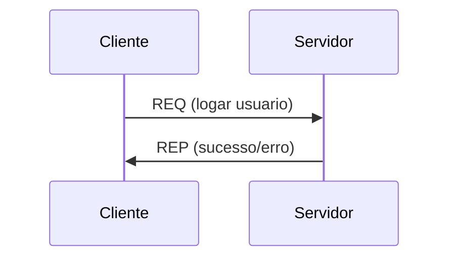
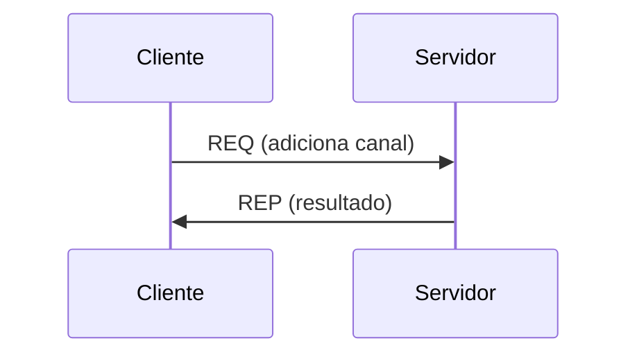
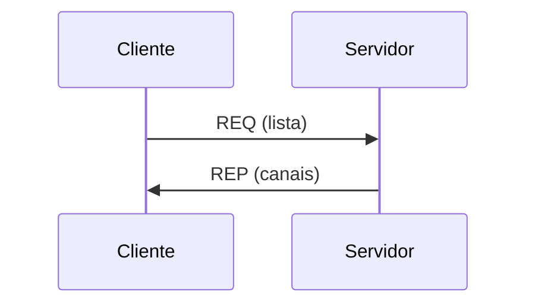
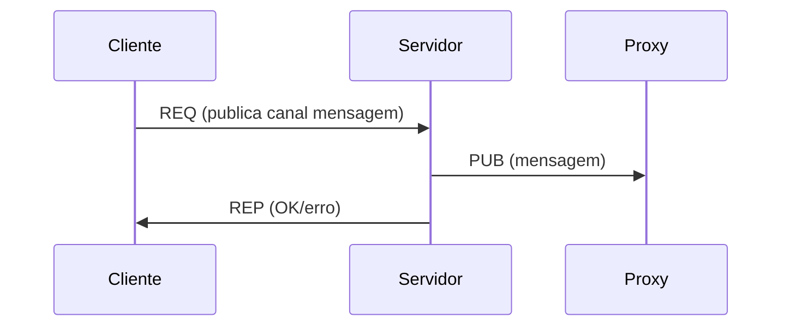
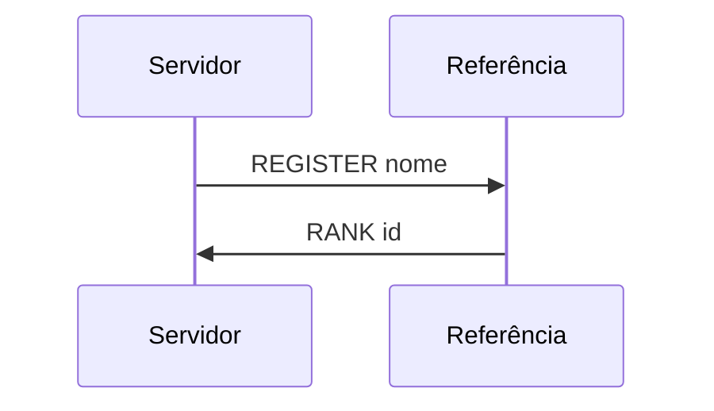
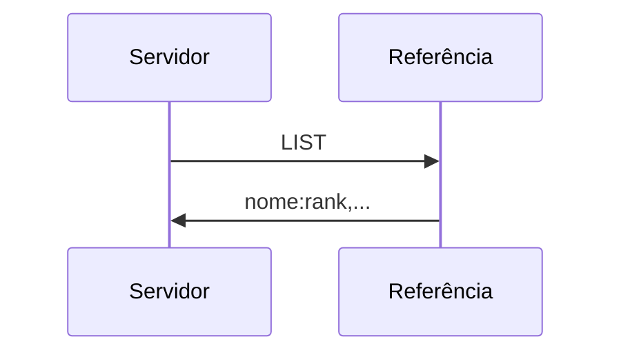
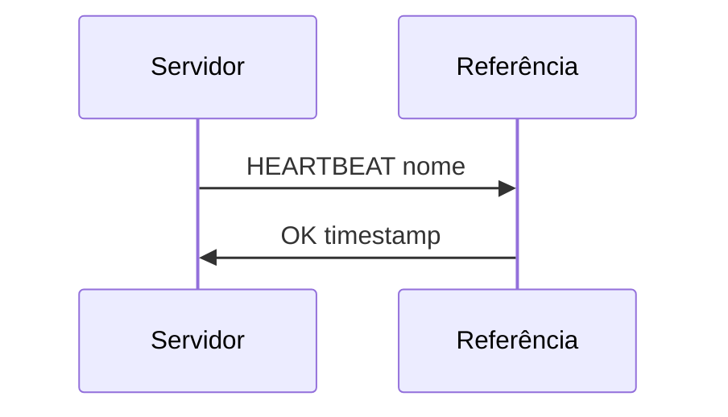

<div align="center">

# PROJETO DE SISTEMAS DISTRIBUÍDOS
</div>

## 📖 Descrição

Este projeto implementa um sistema distribuído de troca de mensagens inspirado em sistemas clássicos como BBS (Bulletin Board System) e IRC (Internet Relay Chat).

O sistema permite que múltiplos clientes (bots) se conectem a servidores, realizem login, criem canais, listem canais disponíveis e publiquem mensagens em canais — tudo de forma distribuída, escalável e automatizada.

A comunicação entre os serviços é feita utilizando **ZeroMQ**, garantindo eficiência, baixo acoplamento e interoperabilidade entre **Java (JeroMQ)** e **Python (PyZMQ)**.

---

# 🚀 Funcionalidades

- [Parte 1](documentacao/parte1.md)
- [Parte 2](documentacao/parte2.md)
- [Parte 3](documentacao/parte3.md)
- [Parte 4](documentacao/parte4.md)
- [Parte 5](documentacao/parte5.md)

---

# 🧠 Arquitetura

O sistema foi dividido em dois modelos de comunicação independentes:
- [Parte 1](documentacao/parte1.md)
- [Parte 2](documentacao/parte2.md)
- [Parte 3](documentacao/parte3.md)
- [Parte 4](documentacao/parte4.md)
- [Parte 5](documentacao/parte5.md)

---

# 🔄 Fluxos de Comunicação

## Login



## Criar canal



## Listar canais



## Publicação (Parte 2)



## Registro de servidor (Parte 3)



---

## Listagem de servidores (Parte 3)



---

## Heartbeat (Parte 3)



---

# 🧾 Formato das Mensagens

### Req/Rep

```text
<clock>|comando
```

Exemplo:

```text
5|logar user_1
```

---

### Pub/Sub

```text
<clock>|canal timestamp mensagem
```

Exemplo:

```text
8|canal_1 2026-04-26T17:40:11 msg_123
```

---

# 🤖 Comportamento dos Bots

Os clientes foram implementados como bots automáticos:

1. Realizam login com usuário aleatório
2. Criam canais se existirem menos de 5
3. Inscrevem-se em até 3 canais
4. Executam continuamente:

   * Escolhem um canal aleatório
   * Enviam 10 mensagens
   * Aguardam 1 segundo entre envios
   * Recebem mensagens dos canais inscritos

✔ Simula ambiente real
✔ Facilita testes e validação

---

# 💾 Armazenamento de Dados

O servidor realiza persistência em arquivos locais:

## 📌 Publicações

```text
canal;mensagem;timestamp
```

## 📌 Requisições

```text
REQ;conteudo;timestamp
```

### 🎯 Justificativa

* Garantir histórico completo
* Permitir auditoria
* Possibilitar recuperação futura

---

# ⚙️ Escolhas de Projeto

### ✔ Uso de Broker (ROUTER/DEALER)

* Permite múltiplos servidores
* Balanceamento automático

### ✔ Proxy Pub/Sub separado

* Isola responsabilidades
* Evita mistura de padrões

### ✔ Uso de tópicos como canais

* Aproveita nativamente o ZeroMQ
* Filtragem eficiente no cliente

### ✔ Servidor como intermediador

* Centraliza validação
* Garante consistência
* Permite persistência

### ✔ Interoperabilidade Java + Python

* Demonstra compatibilidade entre linguagens
* Facilita testes e prototipação

---

# 🛠️ Tecnologias Utilizadas

* ZeroMQ (JeroMQ / PyZMQ)
* Docker / Docker Compose

---

# 💻 Linguagens Utilizadas

* Java
* Python

---

# ▶️ Como Executar

Na pasta do projeto:

```bash
docker compose up
```

