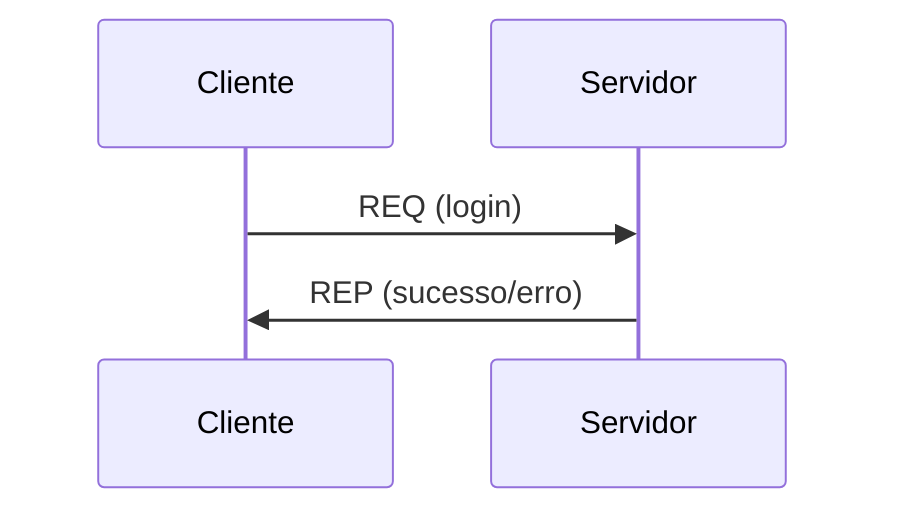
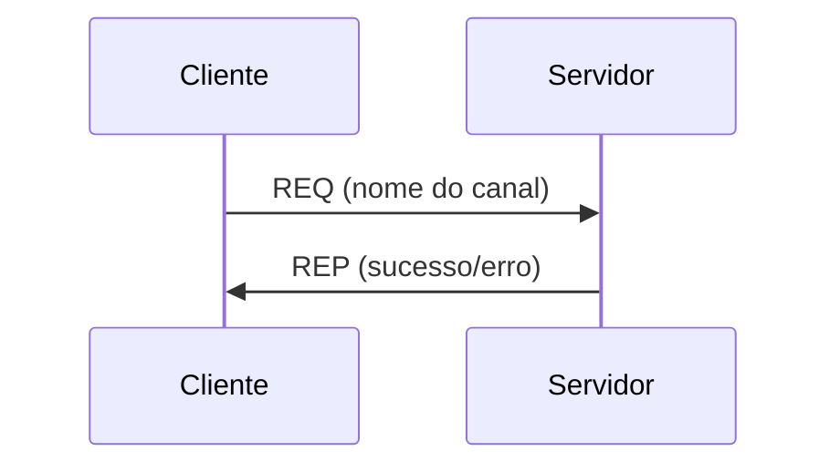
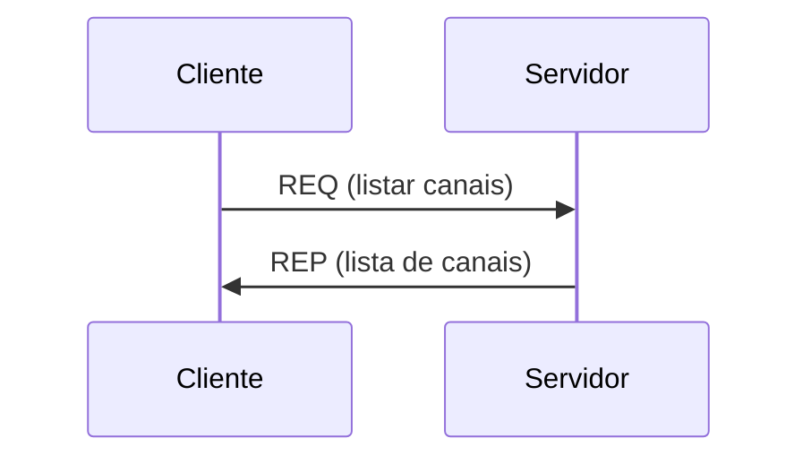

<div align="center">

# PROJETO DE SISTEMAS DISTRIBUÍDOS
</div>

## 📖 Descrição

Este projeto implementa um sistema distribuído de troca de mensagens inspirado em sistemas clássicos como BBS (Bulletin Board System) e IRC (Internet Relay Chat).

O objetivo é permitir que múltiplos clientes (bots) se conectem a servidores, realizem login, criem canais e listem canais disponíveis — tudo de forma distribuída, escalável e sem interação manual do usuário.

A comunicação entre os serviços é feita utilizando **ZeroMQ**, garantindo eficiência e desacoplamento entre os componentes.

---

## 🚀 Funcionalidades (Parte 1)

Nesta primeira etapa do projeto, foram implementadas as seguintes funcionalidades:

### 🔐 Login de Usuário
- O cliente (bot) realiza login enviando apenas um nome de usuário
- O servidor valida e responde com:
  - sucesso ✅
  - erro ❌

### 📂 Criação de Canais
- Clientes podem criar novos canais
- O servidor:
  - valida duplicidade
  - responde com sucesso ou erro

### 📋 Listagem de Canais
- Cliente solicita lista de canais disponíveis
- Servidor retorna todos os canais cadastrados

### 💾 Persistência de Dados
Os dados são armazenados localmente em disco:
- logins realizados (com timestamp)
- canais criados

Cada servidor mantém seus próprios dados (sem compartilhamento).

---

## 🧠 Arquitetura

O sistema segue uma arquitetura distribuída baseada em:

- **Clientes (Bots)**  
  Responsáveis por enviar requisições

- **Servidores**  
  Processam requisições e gerenciam estado

- **Comunicação via ZeroMQ**
  - Padrão REQ/REP para operações síncronas

---

## 🔄 Fluxos de Comunicação

### Login


### Criar canal


### Listar canais


## 🧾 Formato das Mensagens

As mensagens seguem os seguintes padrões obrigatórios:

- Contêm timestamp
- São serializadas em formato binário

🔧 Tecnologia de Serialização
- Protocol Buffers / MessagePack / Avro / Thrift

---

## 🛠️ Tecnologias Utilizadas

- ZeroMQ → comunicação entre serviços
- Docker / Docker Compose → orquestração

---

## Linguagens utilizadas
- Python e Java

---

## Como executar (Por enquanto)
- Digite no terminal da pasta 'projeto' (Python) e na pasta 'java' (Java) <br>
``` docker compose up ```