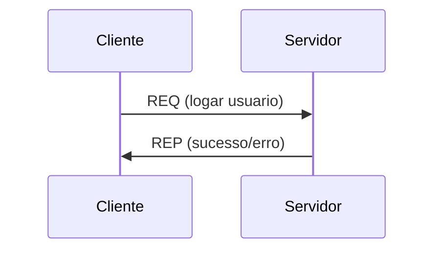
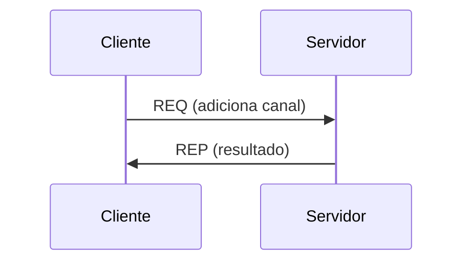
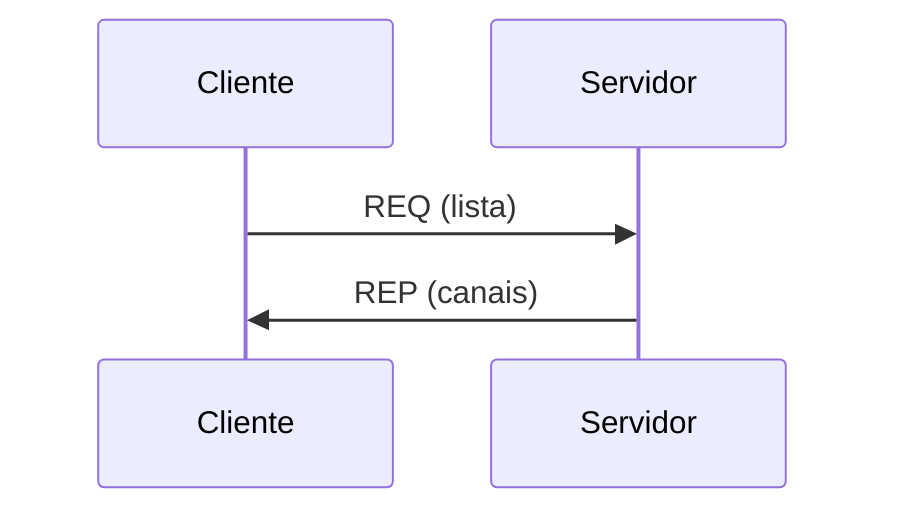
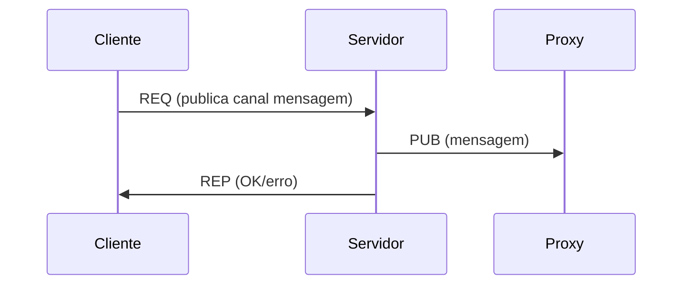
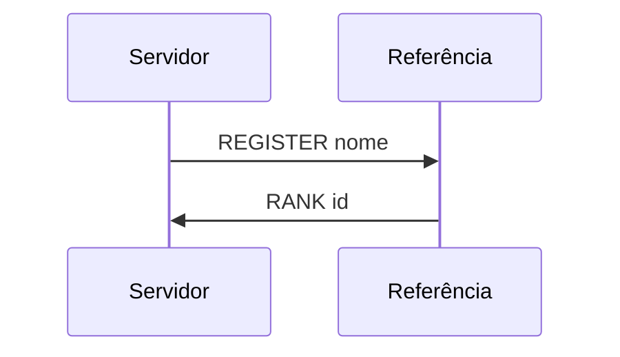
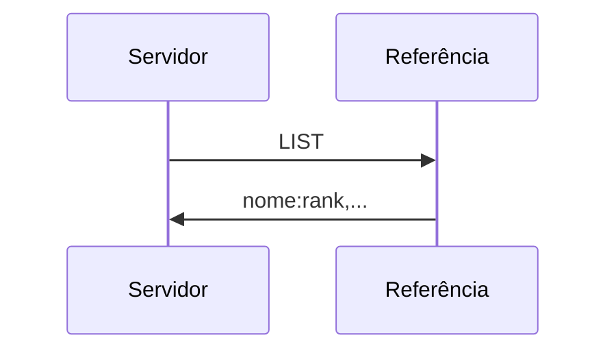
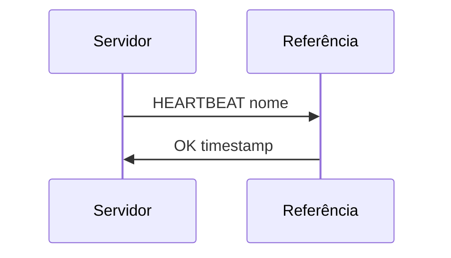
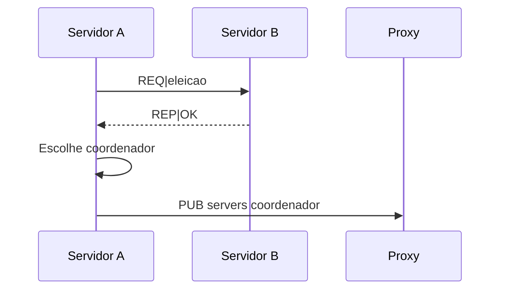

## Login



## Criar canal



## Listar canais



## Publicação (Parte 2)



## Registro de servidor (Parte 3)



---

## Listagem de servidores (Parte 3)



---

## Heartbeat (Parte 3)



## Eleição (Parte 4)


## Sincronização Berkeley (Parte 4)
```mermaid
sequenceDiagram
    sequenceDiagram
    Servidor->>Coordenador: REQ_HORA
    Coordenador-->>Servidor: REP_HORA|timestamp
    Servidor->>Servidor: Calcula RTT e ajusta clock
```