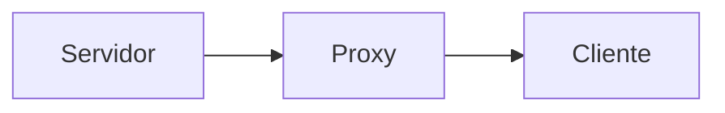

# Funcionalidades
## 🔹 Parte 2 – Pub/Sub

### 📡 Publicação em Canais

* Cliente solicita publicação ao servidor
* Servidor publica no canal correspondente

### 📥 Inscrição em Canais

* Clientes se inscrevem em múltiplos canais
* Recebem mensagens automaticamente

### ⏱️ Controle de Tempo

Cada mensagem contém:

* Timestamp de envio (servidor)
* Timestamp de recebimento (cliente)

### 💾 Persistência Avançada

* Publicações armazenadas em disco
* Requisições registradas (log completo)

# Arquitetura
## 📡 Pub/Sub (Parte 2)

* Servidor: PUB
* Cliente: SUB
* Proxy: XSUB/XPUB